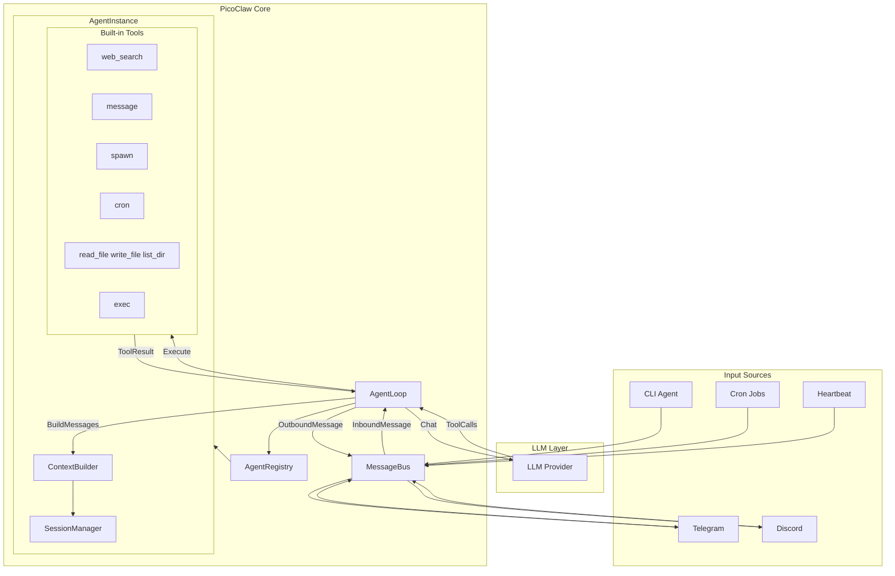

# PicoClaw Architecture - Detailed Understanding Profile

## 1. Project Overview

PicoClaw is an **ultra-lightweight personal AI assistant** written in Go, inspired by [NanoBot](https://github.com/HKUDS/nanobot). It was refactored from the ground up through a self-bootstrapping process where the AI agent itself drove the architectural migration and code optimization.

### Key Specifications

| Metric | Value |
|--------|-------|
| Memory footprint | <10MB RAM (99% smaller than OpenClaw) |
| Hardware cost | $10 (98% cheaper than Mac Mini) |
| Boot time | <1 second (400× faster than OpenClaw) |
| Architectures | RISC-V, ARM64, x86 (single binary) |
| AI-generated core | ~95% with human-in-the-loop refinement |

### Design Philosophy

- **Minimal dependencies** - Single self-contained binary
- **Resource efficiency** - Runs on embedded devices (LicheeRV Nano, NanoKVM, MaixCAM)
- **Portability** - One-click deployment across platforms

---

## 2. Directory Structure

```
picoclaw/
├── cmd/picoclaw/          # Main entry point, CLI commands
├── pkg/
│   ├── agent/             # Agent loop, registry, context, memory
│   ├── auth/              # OAuth, token authentication
│   ├── bus/               # Message bus (inbound/outbound)
│   ├── channels/          # Telegram, Discord, QQ, DingTalk, LINE, Slack, OneBot
│   ├── config/            # JSON config loading
│   ├── constants/         # Shared constants
│   ├── cron/              # Scheduled jobs
│   ├── devices/           # USB/device event handling
│   ├── health/            # Health check endpoints
│   ├── heartbeat/         # Periodic tasks (HEARTBEAT.md)
│   ├── logger/            # Structured logging
│   ├── migrate/           # OpenClaw migration
│   ├── providers/         # LLM providers
│   ├── routing/           # Message routing (channel → agent)
│   ├── session/          # Conversation history, summarization
│   ├── skills/            # Custom skill loading
│   ├── state/             # Persistent state
│   ├── tools/             # Tool interface, registry, built-in tools
│   ├── utils/             # Utilities
│   └── voice/             # Voice transcription (Groq Whisper)
├── config/                # Config templates
├── workspace/             # Embedded workspace templates
└── docs/                  # Documentation
```

---

## 3. Data Flow Architecture



---

## 4. Tool Architecture (Critical for Extensions)

### 4.1 Tool Interface

All tools implement the `tools.Tool` interface:

```go
type Tool interface {
    Name() string
    Description() string
    Parameters() map[string]interface{}
    Execute(ctx context.Context, args map[string]interface{}) *ToolResult
}
```

### 4.2 Optional Interfaces

- **ContextualTool** - Receives channel/chatID for message routing
- **AsyncTool** - Returns immediately, notifies via callback when done

### 4.3 ToolResult Structure

```go
type ToolResult struct {
    ForLLM   string  // Content sent to LLM for context
    ForUser  string  // Content sent directly to user
    Silent   bool    // Suppress user message
    IsError  bool    // Indicates failure
    Async    bool    // Running asynchronously
    Err      error   // Underlying error
}
```

### 4.4 Registration Flow

1. **Per-agent tools** - Registered in `NewAgentInstance()` (read_file, write_file, list_dir, exec, edit_file, append_file)
2. **Shared tools** - Registered in `registerSharedTools()` (web_search, web_fetch, message, spawn, i2c, spi)
3. **Gateway tools** - Registered via `agentLoop.RegisterTool()` (cron)

### 4.5 Schema Conversion

`ToolToSchema()` converts tools to OpenAI function-calling format. The agent's `ToProviderDefs()` produces the format expected by LLM provider APIs.

---

## 5. Agent Loop Flow

```
1. Message arrives via MessageBus (InboundMessage)
2. Route resolution: channel/account/peer → agent ID
3. Get agent from registry (or default)
4. Build messages: system prompt + history + summary + user message
5. Call LLM with tool definitions
6. If LLM returns tool_calls:
   a. Execute each tool via ToolRegistry.ExecuteWithContext()
   b. Append tool results to messages
   c. Loop to step 5 (next LLM call)
7. If no tool_calls:
   a. Save assistant message to session
   b. Optionally trigger summarization (if history exceeds threshold)
   c. Publish response via MessageBus (OutboundMessage)
```

### 5.1 Session Management

- Sessions stored in `workspace/sessions/`
- History + summary for context continuity
- Summarization when token estimate exceeds 75% of context window
- Emergency compression drops oldest 50% on context limit errors

---

## 6. Configuration

### 6.1 Config Path

- **File:** `~/.picoclaw/config.json`
- **Workspace:** `~/.picoclaw/workspace/` (configurable)

### 6.2 Key Sections

| Section | Purpose |
|---------|---------|
| `agents.defaults` | Model, max_tokens, temperature, workspace, restrict_to_workspace |
| `agents.list` | Multi-agent configuration with routing |
| `providers` | LLM API keys (OpenRouter, Zhipu, Anthropic, OpenAI, Groq, etc.) |
| `channels` | Telegram, Discord, QQ, DingTalk, Slack, LINE, OneBot |
| `tools.web` | Brave, DuckDuckGo, Perplexity search |
| `tools.cron` | Exec timeout for scheduled jobs |
| `heartbeat` | Periodic task interval (minutes) |

### 6.3 Workspace Layout

```
~/.picoclaw/workspace/
├── sessions/          # Conversation history
├── memory/            # Long-term memory (MEMORY.md)
├── state/             # Persistent state
├── cron/              # Scheduled jobs database
├── skills/            # Custom skills
├── AGENT.md           # Agent behavior guide
├── HEARTBEAT.md       # Periodic task prompts
├── IDENTITY.md        # Agent identity
├── SOUL.md            # Agent soul
└── USER.md            # User preferences
```

---

## 7. Security Sandbox

### 7.1 Workspace Restriction

When `restrict_to_workspace: true` (default):

- `read_file`, `write_file`, `list_dir`, `edit_file`, `append_file` - Only paths within workspace
- `exec` - Command paths must be within workspace

### 7.2 Blocked Commands (Always)

- `rm -rf`, `del /f`, `rmdir /s` - Bulk deletion
- `format`, `mkfs`, `diskpart` - Disk formatting
- `dd if=` - Disk imaging
- Writing to `/dev/sd[a-z]`
- `shutdown`, `reboot`, `poweroff`
- Fork bomb pattern

---

## 8. Channel Integration

Channels connect external messaging platforms to the MessageBus:

- **Inbound:** Channel receives message → `bus.PublishInbound()`
- **Outbound:** Agent response → `bus.ConsumeOutbound()` → Channel sends to user

Each channel has `allow_from` for access control.

---

## 9. LLM Provider Architecture

- **OpenAI-compatible:** OpenRouter, Groq, Zhipu, vLLM
- **Anthropic:** Claude-native API
- **Fallback chain:** Multiple model candidates with cooldown on failures
- **OAuth/Token:** OpenAI, Anthropic auth via `pkg/auth`

---

## 10. Extensibility Points

1. **New tools** - Implement `tools.Tool`, register in `registerSharedTools()` or `RegisterTool()`
2. **New channels** - Implement channel interface, add to `channels.Manager`
3. **New providers** - Implement `providers.LLMProvider`, add to `providers.CreateProvider()`
4. **Skills** - Drop SKILL.md in `workspace/skills/` for custom behavior
5. **MCP integration** - Add tools that proxy to external MCP servers (e.g., AWS MCP)

---

## 11. AWS MCP Integration (Enhanced)

PicoClaw can be enhanced with AWS MCP Server integration. When enabled, tools from the AWS MCP Server are registered with the `aws__` prefix.

### Enabling AWS MCP

1. Install uv: `curl -LsSf https://astral.sh/uv/install.sh | sh`
2. Configure AWS credentials: `aws configure` or `aws login`
3. Add to `~/.picoclaw/config.json`:

```json
"tools": {
  "aws_mcp": {
    "enabled": true,
    "region": "us-west-2",
    "proxy_command": "uvx",
    "proxy_args": ["mcp-proxy-for-aws@latest", "https://aws-mcp.us-east-1.api.aws/mcp", "--metadata", "AWS_REGION=us-west-2"]
  }
}
```

4. Run: `picoclaw agent -m "What AWS regions are available?"`

### IAM Permissions

Ensure your AWS credentials have: `aws-mcp:InvokeMcp`, `aws-mcp:CallReadOnlyTool`, `aws-mcp:CallReadWriteTool`
